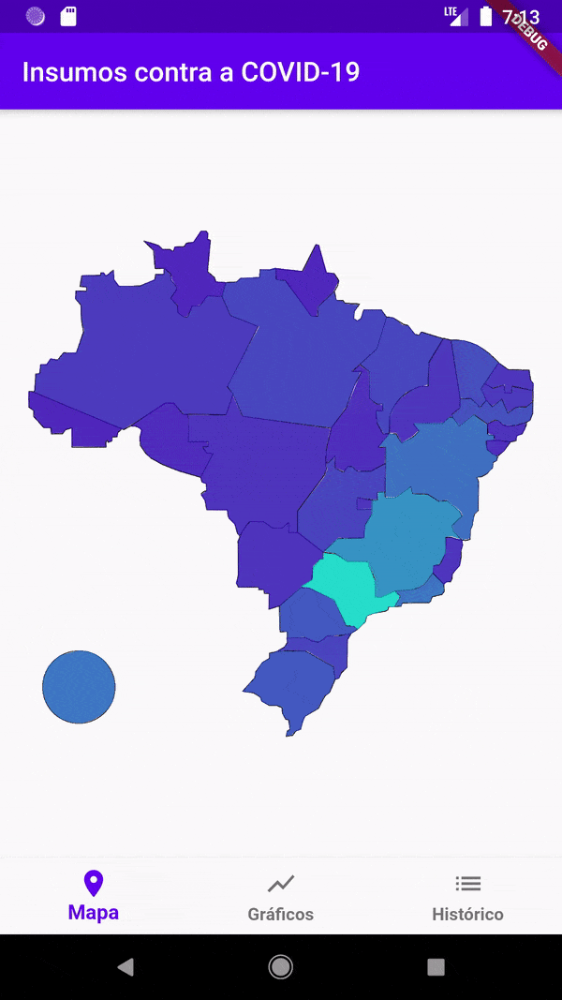
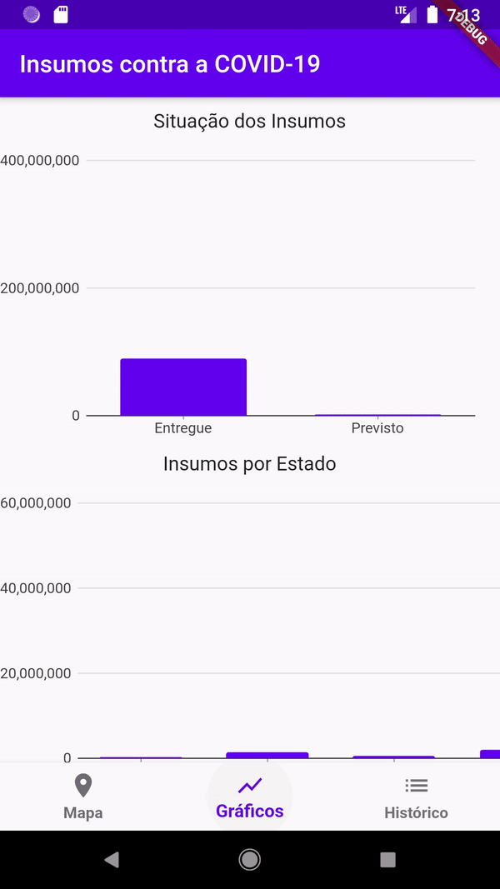

# Insumos contra a COVID-19

Aplicativo para visualização dos dados disponibilizados pelo Ministério da Saúde sobre os equipamentos de proteção individual (EPIs) e insumos de saúde distribuídos em razão do combate à pandemia de COVID-19.

[Fonte dos dados](https://dados.gov.br/dataset/distribuicao-de-equipamentos-de-protecao-individual-e-insumos-covid-19)

Trabalho relativo a matéria Optativa 2 - Desenvolvimento mobile, do Instituto Federal de Brasília, Campus Taguatinga.

## Telas
___

    
    
    

## Referências
___

[online documentation](https://flutter.dev/docs)